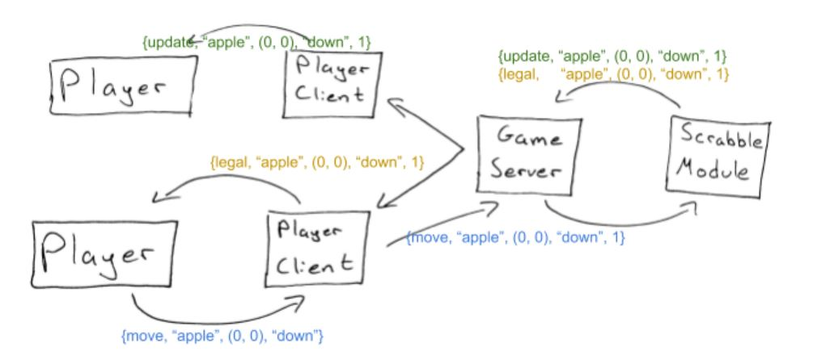

# Concurrent Scrabble Initial Design 

### Group Members:
* Billy Witrock
* Saad Mazhar
* Irving Pena
* Jose Ortiz

### Design Decision

1.	Here is a problem that we want to address.
	   * Our main problem to address in this project is how we are going to keep track of the player’s moves and the board state so that all players have an updated board after a move has been made.
2.	Here are two ways we considered addressing it.
	   * One option was to implement a server that controls the board and keeps track of all the tiles. Using Erlport, we send messages to the server and wait for its response. It is up to the server to validate the word and validate if the position in the board has not been taken yet. If valid, the response holds the word, its starting index within the board, and the direction within the board (up, down, left, right).
	   * Another option was to have shared memory threads when keeping track of the player’s moves and the board state, where we just have one 2D array to hold the board and then all the different players change the same spot in memory. This requires having a barrier that locks every time until all players have processed their turn. It also requires a lock for the board, which is acquired each time a player makes a move and causes all other threads to wait for the lock to release before making another move.
3.	Here is the one we choose (at least provisionally) and why
    * We chose to do a server that keeps track of the board, tiles, and scores. Once a player makes a move, it sends the move to the Erlang node that started the player instance. This node then sends the move to the Erlang server, which then passes it along to a Python module that controls the game logic. This is where the word and move will be validated. If the move is legal, it then sends a response to the Erlang server to update the board for all of its clients. These clients will then send messages to each of its Python clients (look at object diagram for a visual). If the move is not legal, the server will send a message to the player who requested it and let them know it is not valid. This solution relies heavily on our understanding of Erlport and being able to handle most of the game logic in Python.

### Diagrams
#### Class Diagram

#### Object Diagram

This will happen when a player makes a move. In this case it is the bottom player (player 1), puts the word, “apple” starting in the upper left and going down. This move is also valid.  This illustrates how messages are passed  to all parties.

### Development Plan

* Nov 5	Learn Erlport. Saad and irving will try to create a sample program that simply sends messages from Python to Erlang. Jose and Billy will try to write a program that sends messages from Erlang to Python. This is to ensure we have a basic understanding of Erlport and can execute our project based on our current architecture. Also setup Github repo
* Nov 12	Have a full implementation of the Player and Board class in Python. Members of this class will be distributed amongst everyone evenly. We also plan to have a functional implementation of a single-player Scrabble game.
* Nov 19	Write the Erlang Server and also update the Scrabble module to accept multi-player. Start AI implementation.
* Nov 26	Incorporate GUI framework to Python. Decide between PyGames and Tkinter. Continue working on AI implementation
* Dec 3	Test intensively and write final report. If we still have time, incorporate AI to final deliverable

So far, we have thoroughly thought out our design and know what modules need to be implemented. Once we have a working example of message sending from/to Python and Erlang via Erlport, we will begin implementing the Player and Board class. Each member of the group will write a portion of each class so as to be aware of what each module is doing. This solves the need for any synchronization later. Also, when implementing our single-player Scrabble in the beginning, everyone will implement an equal amount of the Scrabble game functions. When we convert this module to accept multiple players, each group member has the option to implement any functions they didn’t work on previously. Finally, when implementing the Erlang server and clients, one person alone will work on the server and will specify the protocol to which messages being sent by the clients must conform to.
